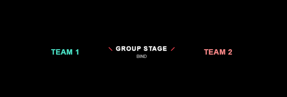

# Valorant Tournament Overlay System

A simple, clean overlay system for Valorant tournament streams. This system provides a real-time updatable overlay for team names, event stage, and map information.



## Features

- Live-updating overlay
- Clean, Valorant-inspired design
- Easy-to-use GUI for updating information
- Automatic data synchronization
- Works with OBS Studio

## Requirements

- Python 3.8 or higher
- OBS Studio
- PyQt5

## Installation

1. Clone or download this repository:
```bash
git clone https://github.com/sarbeshkc/Valorant-Team-Updater.git
cd valorant-overlay
```

2. Install dependencies:
```bash
python3 -m venv venv
source venv/bin/activate  # On Windows: .\venv\Scripts\activate
pip install -r requirements.txt
```

3. Make the run script executable:
```bash
chmod +x run.sh  # On Windows, use run.bat instead
```

## Usage

1. Start the application:
```bash
./run.sh  # On Windows: run.bat
```

2. In OBS Studio:
   - Add a new Browser source
   - Check "Local file"
   - Select `overlay/index.html` from this project
   - Set width to 1920
   - Set height to 97
   - Check "Refresh browser when scene becomes active"

3. Using the Updater:
   - Enter team names
   - Set event stage (e.g., FINAL, SEMI-FINAL)
   - Enter map name
   - Changes update automatically

## File Structure
```
valorant_overlay/
├── app/
│   ├── updater.py        # GUI application
│   ├── server.py         # Local data server
│   └── config.json       # Configuration settings
├── data/                 # Data files
├── overlay/             
│   └── index.html        # OBS overlay
├── run.sh               # Linux/Mac start script
├── run.bat              # Windows start script
└── README.md            # This file
```

## Troubleshooting

1. If the overlay isn't updating:
   - Check if the server is running (should start automatically)
   - Refresh the browser source in OBS
   - Make sure the data directory has write permissions

2. If you get a "port in use" error:
   - Close any previous instances of the application
   - Check if another application is using port 8080

## Contributing

Feel free to fork this project and submit pull requests for any improvements.

## Credits

Created by Sarbesh Kc
Inspired by Valorant's UI design

## Contact

For issues or suggestions, please open an issue on GitHub or contact [your contact info].
